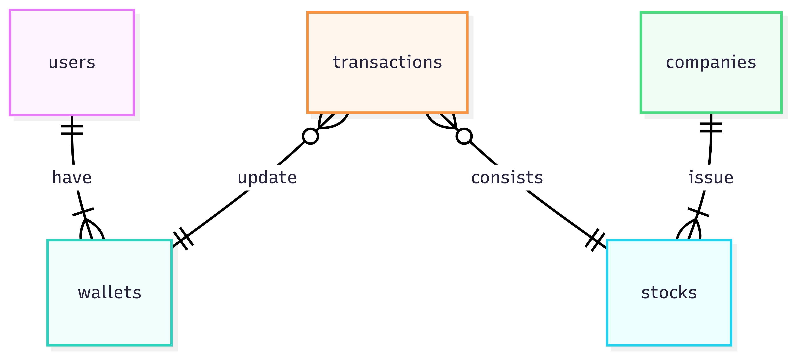

# Design Document

By Andrii Fokin

---

### Scope

This is a database for a simple stock trading service. It is designed to include the necessary entities for basic stock trading functionality.

**People, places, things, etc. within scope:**
* **Users:** Stores user account information like username, email, and password.
* **Wallets:** Manages the monetary balance for each user, with the possibility of multiple wallets per user, though the current design assumes one.
* **Companies:** Contains details about the companies whose stocks are traded.
* **Stocks:** Holds information for each stock, including its unique ticker symbol and current price.
* **Transactions:** A single table that logs all money deposits and stock trades.

**People, places, things, etc. outside of scope:**
* More complex financial instruments beyond simple stocks.
* An order book to match buy and sell orders.
* Real-time market data or historical stock price tracking.
* Functionality to handle corporate actions like dividends or stock splits.

---

### Functional Requirements

This database allows a user to perform basic stock trading actions.

**What a user should be able to do with the database:**
* **Create an account:** A user can be registered, which automatically creates a corresponding wallet for them.
* **Deposit money:** Users can add funds to their wallets, and these deposits are recorded as transactions.
* **Buy and sell stocks:** A stored procedure, `process_stock_transaction`, is used to handle buying and selling shares.
* **View their portfolio:** A `stock_per_user` view provides a summary of a user's stock holdings, including the share count, average buy price, and current market value.
* **View transaction history:** Users can review their history of both money and stock transactions using the `money_transactions` and `stock_transactions` views.

**What's beyond the scope of a user's actions:**
* Placing complex order types like limit or stop-loss orders.
* Withdrawing money to an external account.
* Tracking dividends or stock splits.

---

### Representation

#### Entities

* **`users`**:
    * **Attributes:** `user_id` (INT, PRIMARY KEY, AUTO_INCREMENT), `username` (VARCHAR(256), NOT NULL, UNIQUE), `email` (VARCHAR(256), NOT NULL, UNIQUE), `password` (VARCHAR(256), NOT NULL), `first_name` (VARCHAR(50), NOT NULL), `last_name` (VARCHAR(50), NOT NULL).
    * **Why types were chosen:** `VARCHAR` is used for text fields with a specific length. `INT` is the standard for integer primary keys, and `AUTO_INCREMENT` ensures a unique ID for each new user.
    * **Why constraints were chosen:** `UNIQUE` constraints on `username` and `email` prevent duplicate user accounts. `NOT NULL` ensures that essential information is always provided.

* **`wallets`**:
    * **Attributes:** `wallet_id` (INT, PRIMARY KEY, AUTO_INCREMENT), `user_id` (INT, NOT NULL), `balance` (DECIMAL(12, 3), NOT NULL, DEFAULT 0).
    * **Why types were chosen:** `DECIMAL(12, 3)` is used to store monetary values precisely, avoiding potential floating-point errors.
    * **Why constraints were chosen:** The `FOREIGN KEY` links each wallet to a user, and a `DEFAULT` value of 0 ensures a new wallet starts empty.

* **`companies`**:
    * **Attributes:** `company_id` (INT, PRIMARY KEY, AUTO_INCREMENT), `c_name` (VARCHAR(255)), `details` (TEXT).
    * **Why types were chosen:** `VARCHAR` is used for the company name, while `TEXT` can hold a longer, more detailed description.
    * **Why constraints were chosen:** `AUTO_INCREMENT` on the primary key simplifies the creation of new company records.

* **`stocks`**:
    * **Attributes:** `stock_id` (INT, PRIMARY KEY, AUTO_INCREMENT), `ticker` (VARCHAR(5), NOT NULL, UNIQUE), `company_id` (INT, NOT NULL), `price` (DECIMAL(12, 4), NOT NULL, CHECK (price > 0)).
    * **Why types were chosen:** A `VARCHAR(5)` is sufficient for standard ticker symbols. `DECIMAL(12, 4)` is used for precision with stock prices.
    * **Why constraints were chosen:** `UNIQUE` on `ticker` ensures no two stocks have the same symbol. The `FOREIGN KEY` links each stock to a company. The `CHECK` constraint prevents a stock price from being zero or negative.

* **`transactions`**:
    * **Attributes:** `transaction_id` (INT, PRIMARY KEY, AUTO_INCREMENT), `date_time` (DATETIME, NOT NULL, DEFAULT `CURRENT_TIMESTAMP`), `wallet_id` (INT, NOT NULL), `asset_type` (ENUM('stock', 'money'), NOT NULL), `balance_change` (DECIMAL(10, 3), NOT NULL), `share_count` (INT), `stock_id` (INT), `transaction_details` (TINYTEXT).
    * **Why types were chosen:** An `ENUM` type is used to restrict the `asset_type` to a specific set of values. `DATETIME` records the exact time of the transaction.
    * **Why constraints were chosen:** `FOREIGN KEY` constraints link transactions to a wallet and a stock. A `CHECK` constraint ensures that only the relevant columns for either a stock or money transaction are populated.

#### Relationships

* **One-to-One:**
    A user is created, and a trigger automatically creates a corresponding wallet. This establishes a one-to-one relationship between the `users` and `wallets` tables. With posibilety to extend relation to One-to-Many where user could have many wallets
* **One-to-Many:**
    * A single `company` can have multiple `stocks`.
    * A single `wallet` can have many `transactions`.
* **Many-to-Many:**
    * There is a many-to-many relationship between `users` and `stocks`. This is handled through the `transactions` table, which serves as a junction table to track which users own which stocks.

---

### Optimizations

* **Indexes:** A `transaction_time_index` is created on the `date_time` column in the `transactions` table. This speeds up queries that filter or sort transactions by time.
* **Views:** Three views were created to simplify common queries:
    * **`stock_transactions`:** Shows a filtered list of only stock-related transactions.
    * **`money_transactions`:** Shows a filtered list of only money-related transactions.
    * **`stock_per_user`:** Provides a summarized view of a user's portfolio by calculating the total shares, average buy price, and current value for each stock they own.

---

### Limitations

* **Missing Historical Data:** The database only stores the current price of a stock, making it unsuitable for historical analysis or tracking price trends over time.
* **Unified Table Complexity:** The single `transactions` table for both money and stocks, while compact, results in `NULL` values and adds complexity due to the `CHECK` constraint.
* **Concurrency Issues:** The trigger-based logic for updating balances and checking for sufficient funds could be prone to race conditions in a high-traffic environment.
* **Implicit Ownership:** A user's stock ownership is not explicitly stored in a separate table but must be calculated from their transaction history, which can be less performant for very large transaction volumes.
